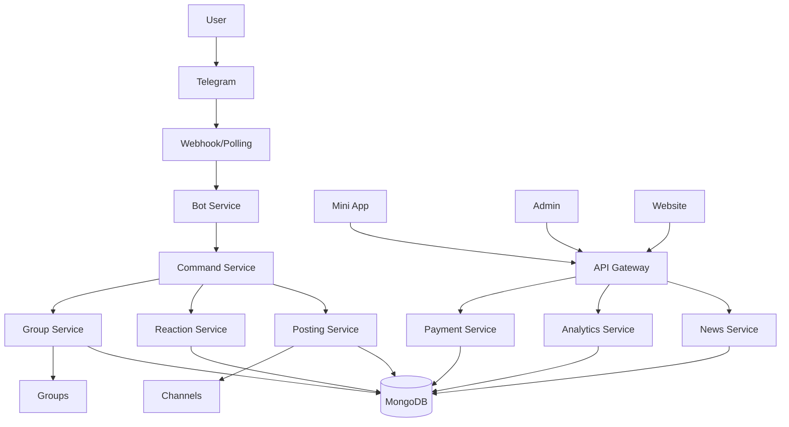

# Zone News Platform - Microservices Architecture

## 🏗️ Architecture Overview

The Zone News platform follows a **modular microservices architecture** with each service having **single responsibility**. The monorepo structure enables code sharing while maintaining service isolation.

```
┌─────────────────────────────────────────────────────────────┐
│                     ZONE NEWS PLATFORM                       │
├─────────────────────────────────────────────────────────────┤
│                                                               │
│  ┌──────────┐  ┌──────────┐  ┌──────────┐  ┌──────────┐   │
│  │   WEB    │  │   API    │  │   BOT    │  │   CMS    │   │
│  │  (Astro) │  │ (Express)│  │(Telegraf)│  │ (Strapi) │   │
│  └─────┬────┘  └─────┬────┘  └─────┬────┘  └─────┬────┘   │
│        │             │              │              │         │
│  ┌─────┴──────────────┴──────────────┴──────────────┴────┐  │
│  │                    SERVICES LAYER                      │  │
│  ├────────────────────────────────────────────────────────┤  │
│  │ • PostingService    • ReactionService  • NewsService  │  │
│  │ • GroupService      • PaymentService   • TierService  │  │
│  │ • CommandService    • CacheService     • AIService    │  │
│  │ • WebhookService    • AnalyticsService • UserService  │  │
│  └────────────────────────────────────────────────────────┘  │
│                                                               │
│  ┌────────────────────────────────────────────────────────┐  │
│  │                    SHARED LIBS                         │  │
│  ├────────────────────────────────────────────────────────┤  │
│  │ • Database Models  • Authentication  • Cache Client   │  │
│  │ • Logger          • Queue System    • Shared Types    │  │
│  └────────────────────────────────────────────────────────┘  │
│                                                               │
│  ┌────────────────────────────────────────────────────────┐  │
│  │                  INFRASTRUCTURE                        │  │
│  ├────────────────────────────────────────────────────────┤  │
│  │ • MongoDB         • Redis           • Docker          │  │
│  │ • PM2            • Nginx           • Cloudflare       │  │
│  └────────────────────────────────────────────────────────┘  │
└─────────────────────────────────────────────────────────────┘
```

## 📦 Monorepo Structure

```
zone-news-monorepo/
├── apps/                    # Applications
│   ├── web/                # Public website (Astro)
│   ├── api/                # REST API (Express)
│   ├── bot/                # Telegram Bot (Telegraf)
│   ├── admin/              # Admin Dashboard (Astro)
│   ├── miniapp/            # Telegram Mini App (React)
│   ├── cms/                # Content Management (Strapi)
│   └── news-api/           # News aggregation API
│
├── services/               # Microservices (Single Responsibility)
│   ├── ai/                # AI/ML operations
│   ├── analytics/         # Analytics & metrics
│   ├── bot/              # Bot orchestration
│   ├── cache/            # Caching strategies
│   ├── channels/         # Channel management
│   ├── commands/         # Command processing
│   ├── groups/           # Group management
│   ├── news/             # News processing
│   ├── payments/         # Payment processing
│   ├── posting/          # Content posting
│   ├── reactions/        # Reaction tracking
│   ├── tiers/            # Subscription tiers
│   ├── users/            # User management
│   └── webhook/          # Webhook handling
│
├── libs/                   # Shared Libraries
│   ├── auth/              # Authentication logic
│   ├── cache/             # Cache clients
│   ├── database/          # Database models & repos
│   ├── logger/            # Logging utilities
│   ├── queue/             # Job queue system
│   └── shared/            # Shared types & constants
│
├── config/                 # Configuration
│   └── pm2/               # PM2 ecosystem files
│
├── scripts/               # Deployment & utility scripts
├── monitoring/            # Health checks & monitoring
└── docker/               # Docker configurations
```

## 🎯 Service Responsibilities

### Core Applications

| Service | Responsibility | Port | Technology |
|---------|---------------|------|------------|
| **Web** | Public website | 3000 | Astro SSG |
| **API** | REST API Gateway | 3001 | Express.js |
| **Bot** | Telegram Bot | 3002 | Telegraf |
| **Admin** | Admin Dashboard | 3003 | Astro + React |
| **MiniApp** | Telegram Mini App | 3004 | React + Vite |
| **CMS** | Content Management | 1337 | Strapi |

### Microservices (Single Responsibility)

#### 📮 **PostingService**
- **Responsibility**: Post content to channels/groups
- **Features**:
  - Manual posting with wizard
  - Auto-posting scheduler
  - Bulk posting
  - Post formatting
  - Post tracking

#### 👍 **ReactionService**
- **Responsibility**: Track and analyze reactions
- **Features**:
  - Reaction counting
  - Sentiment analysis
  - Engagement metrics
  - Reaction handlers
  - Statistics

#### 📰 **NewsService**
- **Responsibility**: News aggregation and processing
- **Features**:
  - RSS feed parsing
  - Content scraping
  - Article categorization
  - Duplicate detection
  - Content enrichment

#### 💳 **PaymentService**
- **Responsibility**: Handle payments and subscriptions
- **Features**:
  - Telegram Stars integration
  - Stripe processing
  - Subscription management
  - Invoice generation
  - Payment webhooks

#### 🤖 **AIService**
- **Responsibility**: AI/ML operations
- **Features**:
  - Content summarization
  - Sentiment analysis
  - Auto-categorization
  - Language translation
  - Content generation

#### 📊 **AnalyticsService**
- **Responsibility**: Track and report metrics
- **Features**:
  - User analytics
  - Content performance
  - Engagement tracking
  - Revenue analytics
  - Custom reports

#### 👥 **GroupService**
- **Responsibility**: Manage Telegram groups
- **Features**:
  - Group registration
  - Member tracking
  - Auto-moderation
  - Group statistics
  - Broadcast messaging

#### 🎯 **CommandService**
- **Responsibility**: Process bot commands
- **Features**:
  - Command routing
  - Permission checking
  - Interactive wizards
  - Command analytics
  - Help system

#### 🌐 **WebhookService**
- **Responsibility**: Handle webhook operations
- **Features**:
  - Webhook server
  - Update processing
  - Health monitoring
  - Request logging
  - Error handling

#### 🏷️ **TierService**
- **Responsibility**: Manage subscription tiers
- **Features**:
  - Tier validation
  - Feature gating
  - Upgrade/downgrade
  - Usage limits
  - Tier benefits

## 🔄 Communication Flow



## 🚀 Deployment Architecture

### Production Environment
- **Server**: Vultr VPS (67.219.107.230)
- **Domain**: thezonenews.com
- **Bot Domain**: bot.thezonenews.com
- **SSL**: Cloudflare (Flexible SSL)
- **Process Manager**: PM2
- **Web Server**: Nginx
- **Database**: MongoDB
- **Cache**: Redis

### Service Deployment
```bash
# PM2 Ecosystem
module.exports = {
  apps: [
    {
      name: 'zone-api',
      script: './apps/api/src/index.js',
      instances: 2,
      exec_mode: 'cluster'
    },
    {
      name: 'zone-bot',
      script: './apps/bot/index.js',
      instances: 1,
      env: {
        WEBHOOK_URL: 'https://bot.thezonenews.com/webhook'
      }
    },
    {
      name: 'zone-news-service',
      script: './services/news/news-service.js',
      instances: 1
    },
    {
      name: 'zone-analytics',
      script: './services/analytics/index.js',
      instances: 1
    }
  ]
};
```

## 🔐 Security & Best Practices

### Service Isolation
- Each service runs in its own process
- Services communicate via defined interfaces
- No shared state between services
- Independent scaling capabilities

### Error Handling
- Graceful degradation
- Circuit breakers
- Retry mechanisms
- Comprehensive logging

### Monitoring
- Health checks for each service
- Performance metrics
- Error tracking
- Alert system

## 📈 Scalability

### Horizontal Scaling
- Services can be independently scaled
- Load balancing via PM2 cluster mode
- Database connection pooling
- Redis caching layer

### Vertical Scaling
- Resource allocation per service
- Memory limits
- CPU affinity
- Process prioritization

## 🛠️ Development Workflow

### Local Development
```bash
# Install dependencies
pnpm install

# Run specific service
pnpm --filter @zone/bot dev
pnpm --filter @zone/api dev
pnpm --filter @zone/web dev

# Run all services
pnpm dev
```

### Testing
```bash
# Unit tests
pnpm test

# Integration tests
pnpm test:integration

# E2E tests
pnpm test:e2e
```

### Deployment
```bash
# Build all services
pnpm build

# Deploy to production
pnpm deploy:production

# Deploy specific service
pnpm deploy:bot
```

## 📊 Service Communication Patterns

### Event-Driven Architecture
```javascript
// NewsService publishes event
eventBus.publish('news.article.created', article);

// PostingService subscribes
eventBus.subscribe('news.article.created', async (article) => {
  await postingService.schedulePost(article);
});

// AnalyticsService subscribes
eventBus.subscribe('news.article.created', async (article) => {
  await analyticsService.trackArticle(article);
});
```

### Service Registry Pattern
```javascript
// Register services
ServiceRegistry.register('posting', PostingService);
ServiceRegistry.register('reactions', ReactionService);
ServiceRegistry.register('analytics', AnalyticsService);

// Get service instance
const posting = ServiceRegistry.get('posting');
await posting.postToChannel(channelId, article);
```

## 🎯 Key Benefits

1. **Single Responsibility**: Each service does ONE thing well
2. **Independent Deployment**: Deploy services without affecting others
3. **Technology Agnostic**: Use best tool for each service
4. **Fault Isolation**: Service failure doesn't crash system
5. **Easy Scaling**: Scale only what needs scaling
6. **Clear Boundaries**: Well-defined service interfaces
7. **Maintainability**: Easy to understand and modify
8. **Testability**: Services can be tested in isolation

## 📝 Service Interface Example

```typescript
// PostingService Interface
interface IPostingService {
  postToChannel(channelId: string, article: Article): Promise<PostResult>;
  postToMultiple(channelIds: string[], article: Article): Promise<PostResult[]>;
  schedulePost(article: Article, timestamp: Date): Promise<void>;
  startAutoPosting(): void;
  stopAutoPosting(): void;
  getPostingStats(): Promise<PostingStats>;
}

// ReactionService Interface
interface IReactionService {
  trackReaction(messageId: string, reaction: Reaction): Promise<void>;
  getReactionStats(messageId: string): Promise<ReactionStats>;
  getTopReacted(limit: number): Promise<Article[]>;
  subscribeToReactions(handler: ReactionHandler): void;
}
```

## 🔄 Data Flow Example

```
1. User sends /post command
   ↓
2. WebhookService receives update
   ↓ [Logs: "Update received"]
3. BotService processes update
   ↓ [Logs: "Processing command"]
4. CommandService routes to handler
   ↓ [Logs: "Routing /post command"]
5. PostingService formats article
   ↓ [Logs: "Formatting article"]
6. PostingService sends to channel
   ↓ [Logs: "Posting to @ZoneNewsAdl"]
7. ReactionService tracks engagement
   ↓ [Logs: "Tracking reactions"]
8. AnalyticsService updates metrics
   ↓ [Logs: "Updating analytics"]
```

---

**Status**: Production Ready ✅
**Architecture**: Microservices
**Services**: 15+ independent services
**Deployment**: Docker + PM2
**Monitoring**: Comprehensive logging