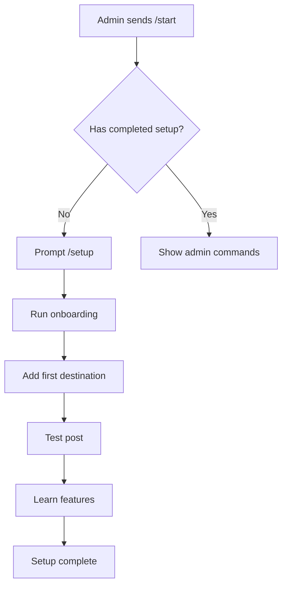

# Zone News Bot - Comprehensive Feature Documentation

## 📋 Table of Contents
1. [Overview](#overview)
2. [Bot Commands](#bot-commands)
3. [User Flows](#user-flows)
4. [Admin Features](#admin-features)
5. [Technical Architecture](#technical-architecture)
6. [Database Schemas](#database-schemas)
7. [State Management](#state-management)
8. [Error Handling](#error-handling)
9. [Deployment](#deployment)
10. [Troubleshooting](#troubleshooting)

---

## 🎯 Overview

**Bot Name:** @ZoneNewsBot  
**Purpose:** News distribution system for Zone News Adelaide  
**Admin:** @TheZoneNews (ID: 8123893898)  
**Infrastructure:** Production server at 67.219.107.230  
**Webhook:** https://bot.thezonenews.com/webhook  

### Key Features
- Multi-destination posting (channels, groups, forum topics)
- Interactive onboarding system
- Real-time news from @ZoneNewsAdl channel
- Admin-only posting with upgrade prompts
- Comprehensive destination management

---

## 🤖 Bot Commands

### Public Commands (All Users)

#### `/start`
- **Purpose:** Welcome message with role detection
- **Response:** 
  - Regular users: Basic welcome + available commands
  - Admins: Welcome + admin commands listed
- **State:** None required

#### `/help`
- **Purpose:** Display all available commands
- **Response:**
  - Public commands for all users
  - Admin commands if user is admin
  - Posting requirements and tips
- **State:** None required

#### `/news`
- **Purpose:** Display latest news from Zone News Adelaide
- **Response:** 
  - Last 5 articles from @ZoneNewsAdl
  - Links to original Telegram posts
  - View counts and categories
- **Database:** Queries `news_articles` collection
- **State:** None required

#### `/status`
- **Purpose:** Bot operational status
- **Response:**
  - Bot online status
  - Total articles count
  - Total views
  - Active since date
- **State:** None required

#### `/search [term]`
- **Purpose:** Search articles by keyword
- **Usage:** `/search adelaide` or `/search "medical news"`
- **Response:** Top 5 matching articles
- **Database:** Full-text search on title and content
- **State:** None required

---

### Admin Commands (@TheZoneNews Only)

#### `/post`
- **Purpose:** Post articles to configured destinations
- **Flow:**
  1. Check admin status → Show upgrade prompt if not admin
  2. Check destinations → Show setup instructions if none
  3. Display destination selector
  4. Show article preview with navigation
  5. Confirm and post
- **State Management:**
  - Stores: `destination`, `topicId`, `articleIndex`, `article`, `message`, `link`
  - Cleared after: Post completion or cancellation
- **Error Handling:**
  - Bot not admin in destination
  - Topic closed
  - Destination not found
- **Database:** 
  - Reads from `news_articles`
  - Writes to `posted_articles`

#### `/setup`
- **Purpose:** Interactive onboarding walkthrough
- **Flow:**
  1. Welcome screen
  2. Explain destination types
  3. Guide through first destination
  4. Test post
  5. Advanced features overview
  6. Completion
- **State Management:**
  - Stores: `step`, `type`
  - Persistent: `completedSetup` in database
- **Database:** Updates `admin_config`

#### `/addchannel`
- **Purpose:** Add Telegram channel as destination
- **Usage Patterns:**
  ```
  /addchannel                        → Interactive mode (asks for channel, then name)
  /addchannel @ZoneNewsAdl          → Interactive mode (asks for name with skip option)
  /addchannel @ZoneNewsAdl "Custom" → Direct mode (adds immediately)
  ```
- **Interactive Flow:**
  1. If no channel provided → Asks for channel username
  2. If channel provided → Asks for display name (with skip option)
  3. User can type name or press "Skip" button for auto-name
  4. User can cancel anytime with `/cancel` or "Cancel" button
- **Validation:**
  - Must start with @
  - Bot must be admin in channel
- **State Management:**
  - Interactive mode stores: `action: 'adding_channel'`, `step: 'waiting_channel' | 'waiting_name'`, `channelId`
  - State cleared on completion or `/cancel`
- **Database:** Updates `admin_destinations`

#### `/addgroup`
- **Purpose:** Add current group as destination
- **Requirements:**
  - Must be sent IN the target group
  - Bot must be admin in group
- **Auto-Detection:**
  - Group ID (automatically detected from context)
  - Group name (automatically detected from chat title)
  - Group type (group/supergroup)
  - Supports both private and public groups
- **Error Handling:**
  - If sent in private chat → Shows instructions to use in group
  - If bot not admin → Prompts to make bot admin
- **Database:** Updates `admin_destinations`

#### `/addtopic`
- **Purpose:** Add forum topic as destination
- **Requirements:**
  - Must be sent IN the target topic thread
  - Group must have forum mode enabled
  - Bot must be admin
- **Auto-Detection:**
  - Group ID (from chat context)
  - Topic thread ID (from message_thread_id)
  - Group name (from chat title)
  - Auto-generates display name: "GroupName - Topic [ID]"
- **Error Handling:**
  - If sent in private chat → Shows instructions
  - If no forum mode → Explains how to enable forum mode
  - If not in topic thread → Guides to send in specific topic
- **Database:** Updates `admin_destinations`

#### `/mydestinations`
- **Purpose:** List all configured destinations
- **Response:**
  - Numbered list with icons
  - Channel/Group/Topic differentiation
  - IDs and names
- **Database:** Reads `admin_destinations`

#### `/scan`
- **Purpose:** Guide for finding available destinations
- **Response:**
  - Instructions for each destination type
  - Tips for getting IDs
  - Links to helper bots

#### `/resetsetup`
- **Purpose:** Reset onboarding completion
- **Effect:** Allows re-running `/setup`
- **Database:** Updates `admin_config.completedSetup = false`

#### `/cancel`
- **Purpose:** Cancel any interactive command flow
- **Usage:** Type `/cancel` during any interactive process
- **Effect:** 
  - Clears current user state
  - Exits interactive mode
  - Returns user to normal command mode
- **Works with:** `/addchannel`, `/setup`, and other interactive flows

---

## 🔄 User Flows

### First-Time Admin Setup


### Posting Flow
```mermaid
graph TD
    A[/post command] --> B{Is admin?}
    B -->|No| C[Show upgrade prompt]
    B -->|Yes| D{Has destinations?}
    D -->|No| E[Show setup instructions]
    D -->|Yes| F[Select destination]
    F --> G[Preview article]
    G --> H{User action?}
    H -->|Confirm| I[Post to destination]
    H -->|Next/Prev| G
    H -->|Cancel| J[Clear state]
    I --> K[Log post]
    K --> J
```

### Adding Channel Flow
```mermaid
graph TD
    A[/addchannel] --> B{Has channel ID?}
    B -->|No| C[Show instructions]
    B -->|Yes| D{Has custom name?}
    D -->|No| E[Generate name from ID]
    D -->|Yes| F[Use custom name]
    E --> G[Save destination]
    F --> G
    G --> H[Confirm success]
    C --> I[Wait for input]
    I --> J{Valid format?}
    J -->|No| K[Show error]
    J -->|Yes| G
```

---

## 👨‍💼 Admin Features

### Admin Identification
- **Single Admin:** @TheZoneNews (ID: 8123893898)
- **Hardcoded:** In `adminIds` array
- **No Dynamic Addition:** Cannot add admins via commands

### Posting Capabilities
- Post to unlimited destinations
- Select articles from database
- Preview before posting
- Navigate through articles
- Custom inline buttons on posts
- Reaction tracking

### Destination Management
- Add channels (public/private)
- Add groups (regular/supergroups)
- Add forum topics
- View all destinations
- No deletion command (manual DB operation)

### Non-Admin Restrictions
- Cannot use `/post`
- Cannot add destinations
- Cannot view admin commands
- Shown upgrade prompts
- Redirected to @TheZoneNews

---

## 🏗️ Technical Architecture

### Stack
- **Runtime:** Node.js
- **Framework:** Telegraf 4.x
- **Database:** MongoDB
- **Process Manager:** PM2
- **Web Server:** Nginx (reverse proxy)
- **Server:** Ubuntu on Vultr VPS

### File Structure
```
zone-news-monorepo/apps/bot/
├── index.js                    # Main bot entry
├── src/
│   ├── posting-service-complete.js    # Full posting service
│   ├── onboarding-service.js         # Onboarding flow
│   └── posting-service-improved.js   # Enhanced version
├── ecosystem.config.js         # PM2 configuration
└── package.json
```

### Service Architecture
```javascript
class ZoneNewsBotApp {
    constructor() {
        this.bot = Telegraf instance
        this.db = MongoDB connection
        this.services = {
            posting: ImprovedPostingService,  // Enhanced with interactive flows
            onboarding: OnboardingService
        }
    }
}
```

---

## 💾 Database Schemas

### Collections

#### `news_articles`
```javascript
{
    _id: ObjectId,
    title: String,
    content: String,
    published_date: Date,
    category: String,
    views: Number,
    url: String,
    zone_news_data: {
        channel: "@ZoneNewsAdl",
        message_id: Number
    }
}
```

#### `admin_destinations`
```javascript
{
    _id: ObjectId,
    telegram_id: Number,  // Admin user ID
    destinations: [{
        id: String,       // Channel @name or group ID
        name: String,     // Display name
        type: String,     // "channel" | "group" | "topic"
        topic_id: Number, // For forum topics
        groupType: String,// "group" | "supergroup"
        added_at: Date
    }]
}
```

#### `admin_config`
```javascript
{
    _id: ObjectId,
    telegram_id: Number,
    completedSetup: Boolean,
    skippedSetup: Boolean,
    setupDate: Date
}
```

#### `posted_articles`
```javascript
{
    _id: ObjectId,
    article_id: ObjectId,
    destination: String,
    topic_id: Number,
    message_id: Number,
    posted_at: Date,
    posted_by: Number
}
```

---

## 🎛️ State Management

### User States Map
```javascript
userStates = new Map()
// Key: userId (number)
// Value: State object
```

### State Objects

#### Posting State
```javascript
{
    destination: String,      // Selected destination
    topicId: Number,         // Topic ID if applicable
    articleIndex: Number,    // Current article index
    article: Object,         // Article data
    message: String,         // Formatted message
    link: String            // Article link
}
```

#### Channel Adding State
```javascript
{
    action: "adding_channel",
    step: "waiting_channel" | "waiting_name",
    channelId: String
}
```

#### Onboarding State
```javascript
{
    step: "welcome" | "types" | "choose_type" | "add_channel" | "test" | "advanced",
    type: "channel" | "group" | "topic"
}
```

### State Lifecycle
1. **Creation:** On command initiation
2. **Updates:** During user interaction
3. **Cleanup:** 
   - On successful completion
   - On `/cancel` command
   - On "Cancel" button press
   - On error occurrence
4. **Timeout:** Planned for 5 minutes (not yet implemented)

### Interactive Flow States
- **Button Callbacks:** `skip_name`, `cancel_add`, `view_plans`, `add_destination`
- **Navigation:** `next_article`, `prev_article` for article browsing
- **Actions:** `post_confirm`, `post_cancel` for posting confirmation

---

## ❌ Error Handling

### Error Types & Responses

#### Bot Permissions
```javascript
if (error.message.includes('not enough rights')) {
    return 'Bot needs admin rights in the destination';
}
```

#### Topic Issues
```javascript
if (error.message.includes('TOPIC_CLOSED')) {
    return 'This topic is closed for posting';
}
```

#### Destination Not Found
```javascript
if (error.message.includes('CHAT_NOT_FOUND')) {
    return 'Destination not found. Make sure bot is added there';
}
```

#### Conflict Errors
```javascript
if (error.message.includes('409')) {
    console.error('⚠️ Another bot instance is running');
    process.exit(0); // Graceful exit
}
```

### Error Recovery
- Clear user state
- Log error details
- Provide user feedback
- Suggest corrective action

---

## 🚀 Deployment

### Local Development
```bash
# Install dependencies
cd zone-news-monorepo/apps/bot
npm install

# Set environment
export TELEGRAM_BOT_TOKEN="8132879580:AAFgNLe51T37LyDSl3g0-_jAsN1-k8ABfPk"
export MONGODB_URI="mongodb://localhost:27017/zone_news_production"
export WEBHOOK_URL="https://bot.thezonenews.com"

# Run bot
node index.js
```

### Production Deployment
```bash
# Copy files to server
scp -r ./src/* root@67.219.107.230:/root/zone-news-monorepo/apps/bot/src/

# SSH to server
ssh root@67.219.107.230

# Start with PM2
cd /root/zone-news-monorepo/apps/bot
pm2 start index.js --name zone-telegram-bot

# Save PM2 config
pm2 save
pm2 startup
```

### Nginx Configuration
```nginx
server {
    listen 443 ssl;
    server_name bot.thezonenews.com;
    
    ssl_certificate /etc/letsencrypt/live/bot.thezonenews.com/fullchain.pem;
    ssl_certificate_key /etc/letsencrypt/live/bot.thezonenews.com/privkey.pem;
    
    location /webhook {
        proxy_pass http://localhost:3002/webhook;
        proxy_http_version 1.1;
        proxy_set_header Host $host;
        proxy_set_header X-Real-IP $remote_addr;
    }
}
```

---

## 🔧 Troubleshooting

### Bot Not Responding
1. Check webhook status:
   ```bash
   curl https://api.telegram.org/bot[TOKEN]/getWebhookInfo
   ```
2. Check PM2 status:
   ```bash
   pm2 status
   pm2 logs zone-telegram-bot
   ```
3. Verify nginx routing:
   ```bash
   curl -I https://bot.thezonenews.com/webhook
   ```

### Commands Freezing (FIXED)
- **Previous Issue:** Commands would freeze when incomplete parameters provided
- **Root Cause:** Expected all parameters in single command
- **Solution Deployed:** Interactive flow with state management
- **Current Status:** ✅ Fixed with ImprovedPostingService
- **How it works:**
  - Commands now guide users step-by-step
  - State properly managed and cleared
  - `/cancel` available to exit any flow
  - Error handlers clear state automatically

### Duplicate Bot Instance
- Error: "409: Conflict"
- Fix: Stop all instances, clear webhook, restart
- Commands:
  ```bash
  pm2 stop all
  curl -X POST https://api.telegram.org/bot[TOKEN]/deleteWebhook
  pm2 start index.js --name zone-telegram-bot
  ```

### Database Connection Issues
- Check MongoDB status: `mongosh`
- Verify connection string
- Check network connectivity

---

## 📝 Future Enhancements

### Planned Features
1. **Automatic Scheduling** - Post at optimal times
2. **AI Content Generation** - Auto-generate posts
3. **Analytics Dashboard** - Track engagement
4. **Multi-Admin Support** - Role-based access
5. **Bulk Posting** - Post to multiple destinations
6. **Content Moderation** - AI-powered filtering
7. **Custom Templates** - Post formatting options
8. **Webhook Management** - Dynamic webhook configuration

### Known Limitations
1. Single admin only (@TheZoneNews)
2. No destination deletion via commands (manual DB operation required)
3. State timeout not yet implemented (planned for 5 minutes)
4. No automatic channel/group discovery
5. No scheduling feature yet
6. No bulk destination management

### Recent Improvements (v2.1.0)
1. ✅ Interactive command flows prevent freezing
2. ✅ Auto-naming for channels
3. ✅ Better error messages and guidance
4. ✅ Support for private/public groups
5. ✅ `/cancel` command for flow control
6. ✅ Improved state management

---

## 📞 Support

**Admin Contact:** @TheZoneNews  
**Bot Username:** @ZoneNewsBot  
**Documentation:** This file  
**Repository:** zone-news-monorepo  

---

*Last Updated: August 14, 2025*
*Version: 2.1.0* - Improved Interactive Commands