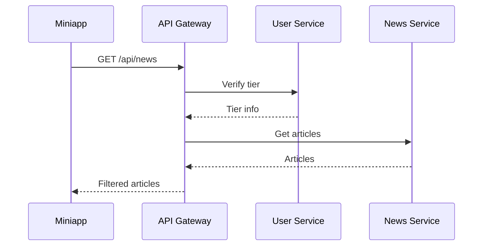
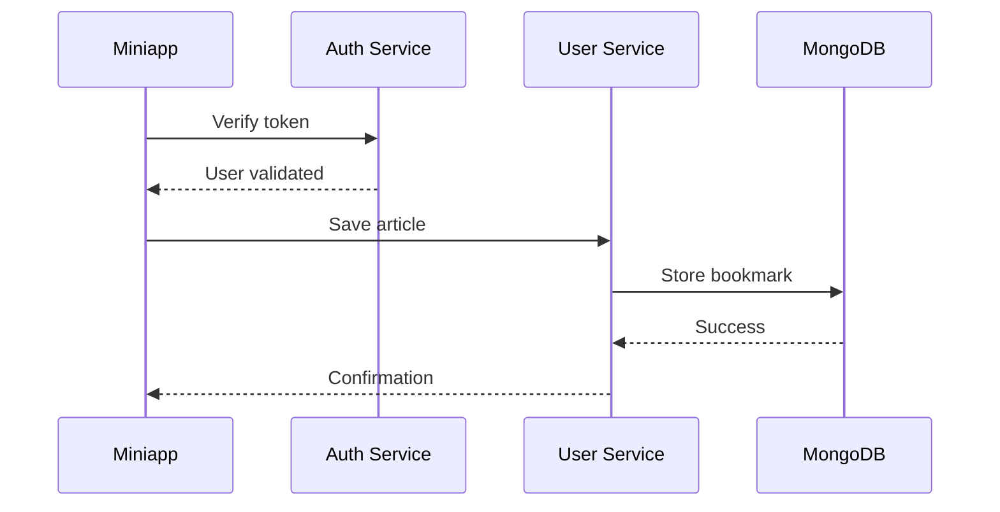

# 📱 Zone News Miniapp Integration Guide

## Overview
The Zone News Telegram Miniapp is a React-based application that provides tier-based news access within Telegram. This guide covers the complete integration between the miniapp and backend services.

## Architecture

```
┌─────────────────┐
│  Telegram App   │
│   (Miniapp)     │
└────────┬────────┘
         │
         ▼
┌─────────────────┐
│   Nginx Proxy   │ :8080 / :80
└────────┬────────┘
         │
    ┌────┴────────────────────────┐
    │                              │
    ▼                              ▼
┌─────────────┐          ┌──────────────┐
│  Static     │          │  API Gateway │
│  Assets     │          │    :3001     │
└─────────────┘          └──────┬───────┘
                                 │
        ┌────────────────────────┼────────────────────────┐
        │                        │                        │
        ▼                        ▼                        ▼
┌──────────────┐        ┌──────────────┐        ┌──────────────┐
│ Auth Service │        │ User Service │        │ News Service │
│    :3015     │        │    :3016     │        │    :3011     │
└──────────────┘        └──────────────┘        └──────────────┘
```

## Service Endpoints

### 1. API Gateway (Port 3001)
- **Base URL**: `http://67.219.107.230:3001`
- **Endpoints**:
  - `GET /api/news` - Fetch news articles
  - `GET /api/news?category={category}` - Filter by category
  - `GET /api/trending` - Get trending articles
  - `GET /api/breaking` - Get breaking news
  - `GET /api/stats` - Get statistics
  - `GET /health` - Health check

### 2. Auth Service (Port 3015)
- **Base URL**: `http://67.219.107.230:3015`
- **Endpoints**:
  - `POST /auth/register` - Register new user
  - `POST /auth/login` - User login
  - `POST /auth/verify-telegram` - Verify Telegram init data
  - `GET /auth/me` - Get current user

### 3. User Service (Port 3016)
- **Base URL**: `http://67.219.107.230:3016`
- **Endpoints**:
  - `GET /user/{userId}/profile` - Get user profile
  - `GET /user/{userId}/tier` - Get user tier
  - `POST /user/{userId}/upgrade` - Upgrade tier
  - `GET /user/{userId}/bookmarks` - Get saved articles
  - `POST /user/{userId}/bookmarks` - Save article
  - `DELETE /user/{userId}/bookmarks/{articleId}` - Remove bookmark

### 4. News API Service (Port 3011)
- **Base URL**: `http://67.219.107.230:3011`
- **Endpoints**:
  - `GET /articles` - List all articles
  - `GET /article/{id}` - Get single article
  - `POST /article/{id}/reaction` - Add reaction
  - `GET /article/{id}/reactions` - Get reactions
  - `POST /article/{id}/view` - Track view

## Miniapp Configuration

### Environment Variables
Create `.env.production` in the miniapp directory:

```env
# API URLs
VITE_API_URL=http://67.219.107.230:3001
VITE_AUTH_SERVICE_URL=http://67.219.107.230:3015
VITE_USER_SERVICE_URL=http://67.219.107.230:3016
VITE_NEWS_SERVICE_URL=http://67.219.107.230:3011

# Bot Configuration
VITE_BOT_USERNAME=ZoneNewsBot
VITE_BOT_TOKEN=YOUR_BOT_TOKEN

# Feature Flags
VITE_ENABLE_ANALYTICS=true
VITE_ENABLE_PUSH_NOTIFICATIONS=true
VITE_ENABLE_OFFLINE_MODE=false
```

## Authentication Flow

### 1. Telegram Init Data Validation
```javascript
// Frontend (miniapp)
const initData = window.Telegram.WebApp.initData;
const response = await fetch('/auth/verify-telegram', {
  method: 'POST',
  headers: { 'Content-Type': 'application/json' },
  body: JSON.stringify({ initData })
});

// Backend validation
const validated = verifyTelegramWebAppData(initData, BOT_TOKEN);
if (validated) {
  const jwt = generateJWT(user);
  return { token: jwt, user };
}
```

### 2. JWT Token Management
```javascript
// Store token
localStorage.setItem('auth_token', token);

// Use in requests
const headers = {
  'Authorization': `Bearer ${token}`,
  'Content-Type': 'application/json'
};
```

## Tier System Implementation

### Tier Limits
| Feature | Free | Pro | Business | Enterprise |
|---------|------|-----|----------|------------|
| Articles/day | 10 | 50 | 200 | Unlimited |
| AI Summaries | ❌ | ✅ | ✅ | ✅ |
| Early Access | ❌ | 30min | 60min | 90min |
| API Access | ❌ | ❌ | ✅ | ✅ |
| History | 7d | 30d | 90d | Unlimited |

### Enforcement Logic
```javascript
// Check tier limits
async function checkTierLimit(userId, action) {
  const user = await getUserWithTier(userId);
  const limits = TIER_LIMITS[user.tier];
  
  const dailyUsage = await getDailyUsage(userId, action);
  if (dailyUsage >= limits[action]) {
    throw new TierLimitExceeded(user.tier, action);
  }
  
  await incrementUsage(userId, action);
  return true;
}
```

## Data Flow

### 1. Article Fetching


### 2. User Actions (Save/React)


## Deployment

### Quick Deploy
```bash
# From monorepo root
cd zone-news-monorepo
./scripts/deploy-miniapp.sh
```

### Manual Deploy Steps
1. Build miniapp: `pnpm build`
2. Upload to server: `scp -r dist/* root@67.219.107.230:/var/www/miniapp/`
3. Configure nginx (see nginx config below)
4. Set bot webhook URL in BotFather

### Nginx Configuration
```nginx
server {
    listen 8080;
    root /var/www/miniapp;
    index index.html;
    
    # CORS for Telegram
    add_header 'Access-Control-Allow-Origin' '*' always;
    add_header X-Frame-Options "ALLOWALL";
    
    location / {
        try_files $uri $uri/ /index.html;
    }
    
    # Proxy API requests
    location /api/ {
        proxy_pass http://localhost:3001/api/;
    }
    
    location /auth/ {
        proxy_pass http://localhost:3015/;
    }
    
    location /user/ {
        proxy_pass http://localhost:3016/;
    }
}
```

## Testing

### Local Testing
```bash
# Start all services
cd zone-news-monorepo
pm2 start config/pm2/ecosystem.monorepo.config.js

# Start miniapp dev server
cd apps/miniapp
pnpm dev

# Use ngrok for Telegram testing
ngrok http 3003
```

### Production Testing
1. Deploy miniapp: `./scripts/deploy-miniapp.sh`
2. Set webhook in BotFather: `http://67.219.107.230:8080`
3. Open bot in Telegram
4. Click menu button to launch miniapp

## Monitoring

### Health Checks
```bash
# Check all services
curl http://67.219.107.230:3001/health
curl http://67.219.107.230:3015/health
curl http://67.219.107.230:3016/health
curl http://67.219.107.230:3011/health

# Check miniapp
curl http://67.219.107.230:8080/
```

### PM2 Monitoring
```bash
# On server
pm2 status
pm2 logs zone-api
pm2 monit
```

## Troubleshooting

### Common Issues

1. **CORS Errors**
   - Ensure nginx has proper CORS headers
   - Check X-Frame-Options is set to ALLOWALL

2. **Authentication Failed**
   - Verify BOT_TOKEN is correct
   - Check initData signature validation
   - Ensure JWT_SECRET matches across services

3. **API Connection Issues**
   - Verify all services are running: `pm2 status`
   - Check port availability: `netstat -tulpn`
   - Review nginx proxy configuration

4. **Tier Limits Not Working**
   - Check MongoDB connection
   - Verify user document has tier field
   - Review daily usage tracking logic

### Debug Mode
Enable debug logging in miniapp:
```javascript
// In main.tsx
if (import.meta.env.DEV) {
  window.DEBUG = true;
  console.log('Telegram WebApp:', window.Telegram.WebApp);
  console.log('Init Data:', window.Telegram.WebApp.initData);
}
```

## Security Considerations

1. **Always validate Telegram init data** on backend
2. **Use HTTPS in production** for all endpoints
3. **Implement rate limiting** per user tier
4. **Sanitize user inputs** before database operations
5. **Use secure JWT secrets** and rotate regularly
6. **Enable CORS** only for trusted origins in production

## Next Steps

- [ ] Implement push notifications
- [ ] Add offline support with service workers
- [ ] Create analytics dashboard
- [ ] Add A/B testing framework
- [ ] Implement content caching strategy
- [ ] Add WebSocket for real-time updates